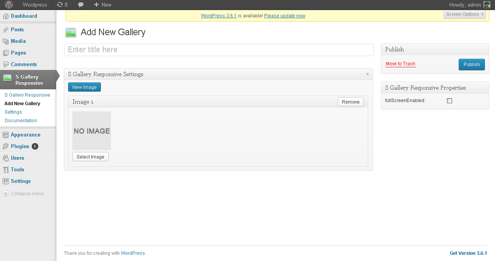
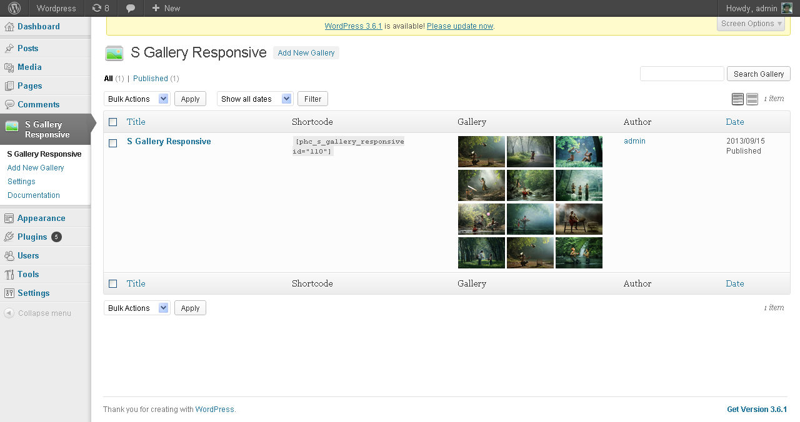
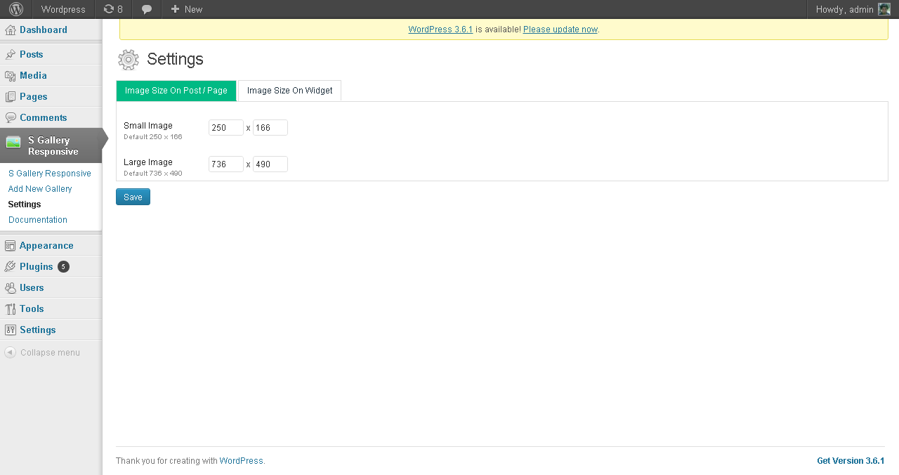
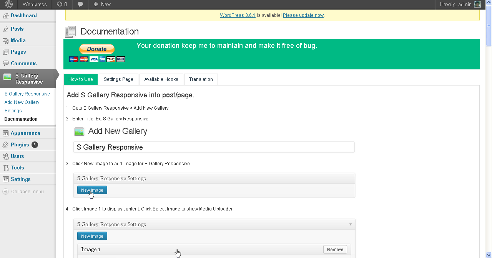

# Wordpress Plugin - S Gallery Responsive

S Gallery Responsive is jQuery Gallery Plugin with CSS3 Animations. 
This plugin make you can create / add it easily using Wordpress.

Features:
* Of Course it's easy to use.
* Using Good User Interface to make you think it's premium stuff.
* Using the WordPress 3.5 Media Uploader.
* Auto Regenerate Images.
* Translation available ( be sure to contribute translate it to your languages ).
* Setting Page to set image size.
* Available Custom Hooks.
* Complete Documentation Page.
* License: [http://creativecommons.org/licenses/by-nc/3.0](http://creativecommons.org/licenses/by-nc/3.0)

Credits:
* SaraSoueidan to create [JQuery Plugin S Gallery Responsive](http://sarasoueidan.com/blog/s-gallery-responsive-jquery-gallery-plugin-with-css3-animations/)
* Icons [emey87.deviantart.com](emey87.deviantart.com)

## Screenshot ( Available Themes )

